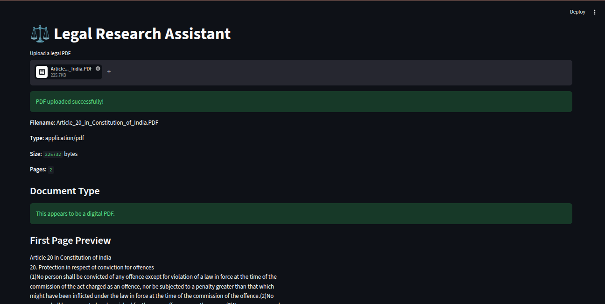
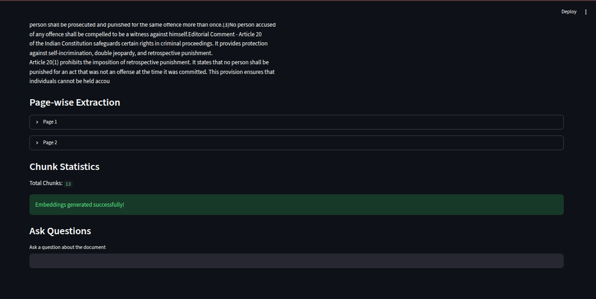
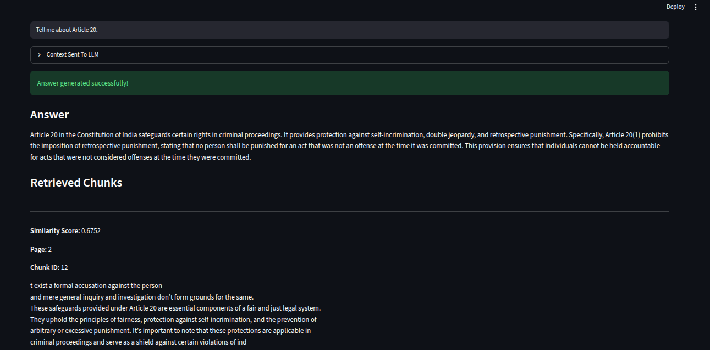
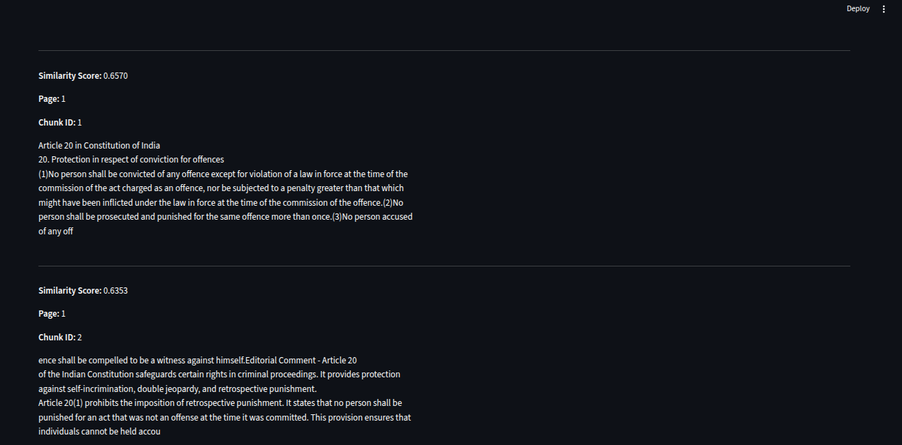

# ⚖️ Legal Research Assistant

A local **Retrieval-Augmented Generation (RAG)** based Legal Research Assistant that answers questions from uploaded legal PDF documents using **semantic search**, **BGE embeddings**, and **llama.cpp** for offline LLM inference.

---

## Overview

This project implements an end-to-end RAG pipeline for legal document question answering. Instead of relying on keyword matching, it retrieves semantically relevant information from the uploaded document and uses a local language model to generate grounded responses.

This project was built from scratch to understand every stage of a RAG pipeline before using optimization libraries such as FAISS or vector databases.

---

## Workflow

```
PDF Upload
      │
      ▼
Text Extraction (PyMuPDF)
      │
      ▼
Document Chunking
      │
      ▼
Embedding Generation (BGE Small)
      │
      ▼
Cosine Similarity Search
      │
      ▼
Top-K Retrieval
      │
      ▼
Context Builder
      │
      ▼
Local LLM (llama.cpp)
      │
      ▼
Answer Generation
```

---

# 📸 Screenshots

## 1. Upload & Document Processing

Shows PDF upload, document type detection, first page preview, page extraction, and chunk generation.




---

## 2. Question Answering

Shows answer generation using the retrieved document context.



---

## 3. Retrieved Context

Displays the retrieved chunks along with similarity scores and metadata before they are passed to the language model.



---

## Features

- Upload legal PDF documents
- Digital vs scanned PDF detection
- Page-wise text extraction
- Document chunking
- Semantic embeddings using **BAAI bge-small-en-v1.5**
- Cosine similarity based retrieval
- Top-K semantic search
- Context construction for RAG
- Local LLM inference using **llama.cpp**
- Streamlit user interface

---

## Tech Stack

| Category | Technology |
|----------|------------|
| Language | Python |
| UI | Streamlit |
| PDF Processing | PyMuPDF |
| Embedding Model | BAAI bge-small-en-v1.5 |
| Embedding Library | Sentence Transformers |
| Similarity Search | Cosine Similarity |
| Local LLM | llama.cpp |
| Numerical Computing | NumPy |

---

## Project Structure

```
Legal-Research-Assistant/
│
├── app.py
├── requirements.txt
├── README.md
│
├── backend/
│   ├── pdf_parser.py
│   ├── chunker.py
│   ├── embeddings.py
│   ├── retriever.py
│   ├── context_builder.py
│   ├── llm.py
│   └── ocr.py
│
├── data/
├── models/
├── screenshots/
└── vectorstore/
```

---

## Engineering Decisions

- Used **semantic embeddings** instead of keyword search to retrieve context based on meaning.
- Implemented **one embedding per chunk** to improve retrieval granularity and support future citation features.
- Used **cosine similarity** for semantic ranking of retrieved chunks.
- Chose **BGE Small** to balance retrieval quality, speed, and memory usage.
- Integrated **llama.cpp** for completely local inference without external APIs.
- Implemented the retrieval pipeline manually instead of using high-level RAG frameworks to understand each component.

---

## Why Semantic Retrieval Instead of Page Index?

A page index retrieves information based only on page numbers and cannot identify the most relevant content for a query.

This project instead uses **semantic vector search**, where both the user's question and document chunks are converted into embeddings. Cosine similarity is then used to retrieve the most relevant chunks regardless of their page location, resulting in more accurate and context-aware retrieval.

---

## Future Improvements

- Conversation memory
- Source citations and explainability
- Streaming responses
- Confidence thresholding
- OCR support for scanned PDFs
- FAISS vector indexing
- FastAPI backend
- Docker deployment
- Improved Streamlit UI

---

## Learning Outcomes

Through this project I explored:

- Retrieval-Augmented Generation (RAG)
- Transformer-based embedding models
- Semantic search
- Embeddings and vector representations
- Cosine similarity
- Document chunking strategies
- Prompt engineering
- Local LLM inference
- Hallucination mitigation using retrieval

---

## Installation

```bash
git clone https://github.com/<your-username>/Legal-Research-Assistant.git

cd Legal-Research-Assistant

python -m venv venv

source venv/bin/activate

pip install -r requirements.txt
```

---

## Run

Start the local language model:

```bash
cd llama.cpp

./build/bin/llama-server \
-m models/qwen2.5-3b-instruct-q4_k_m.gguf \
--port 9000
```

Run the Streamlit application:

```bash
streamlit run app.py
```

---

## Version

**Current Version:** v1.0

This version focuses on understanding and implementing the complete RAG pipeline from scratch.

Future versions will introduce scalable retrieval, explainability, deployment, and production-oriented features.

---

## License

This project is intended for learning and educational purposes.
